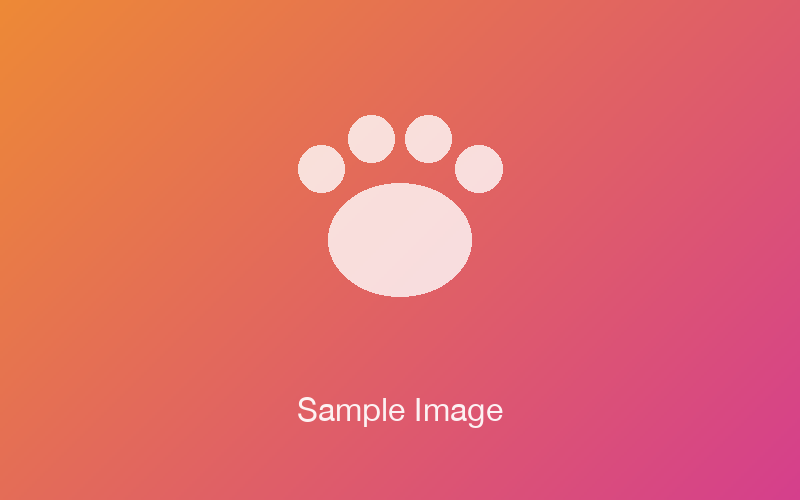

Nekote Blogで使えるマークダウン記法のサンプル集です。それぞれの記法について、コードブロックとそのすぐ下の表示を見比べられます。

## frontmatter

ファイル先頭の`---`で囲まれた部分がfrontmatterです。記事のタイトルなどのメタ情報をYAML形式で書きます。

```md
---
title: 記事のタイトル
tags: [日記, お知らせ]
emoji: "📝"
---

本文
```

必須なのは`title`だけです。使えるキーの一覧は[ようこそ記事](./welcome.md)にまとまっています。

## 見出し

```md
## 見出し

### 小見出し
```

この記事の各見出しが、そのまま表示例です。見出しのレベルは自動で整えられます。記事タイトルが`h1`、本文でいちばん上の見出しが`h2`になるようにずれるため、`# `始まりで書いても`## `始まりで書いても同じ表示になります。

## 段落と改行

```md
空行を挟むと、別の段落になります。

改行を1つ入れただけの行は、
同じ段落の中でつながります。
```

空行を挟むと、別の段落になります。

改行を1つ入れただけの行は、
同じ段落の中でつながります。

段落の中で改行したいときは、行末に半角スペースを2つ置きます。

## テキストの装飾

```md
**太字**、*斜体*、~~打ち消し線~~、`インラインコード`が使えます。

HTMLタグを併用すると、<mark>マーカー</mark>や<kbd>Ctrl</kbd>+<kbd>K</kbd>のようなキー表記、<small>小さい文字</small>も書けます。
```

**太字**、*斜体*、~~打ち消し線~~、`インラインコード`が使えます。

HTMLタグを併用すると、<mark>マーカー</mark>や<kbd>Ctrl</kbd>+<kbd>K</kbd>のようなキー表記、<small>小さい文字</small>も書けます。

使えるHTMLタグは安全な範囲に限定されています。

## リスト

```md
- 箇条書き
- 箇条書き
  - 入れ子にできます

1. 番号付きリスト
2. 番号付きリスト

- [ ] タスクリスト（未完了）
- [x] タスクリスト（完了）
```

- 箇条書き
- 箇条書き
  - 入れ子にできます

1. 番号付きリスト
2. 番号付きリスト

- [ ] タスクリスト（未完了）
- [x] タスクリスト（完了）

## 引用

```md
> 引用文です。
> 行を続けて書くと、ひとつの段落にまとまります。
>
> `>`だけの行を挟むと、段落を分けられます。
```

> 引用文です。
> 行を続けて書くと、ひとつの段落にまとまります。
>
> `>`だけの行を挟むと、段落を分けられます。

## リンク

```md
[Nekote Blog](https://nekote.blog)への外部リンク。

同じリポジトリ内の記事への相対リンク: [ようこそ記事](./welcome.md)
```

[Nekote Blog](https://nekote.blog)への外部リンク。

同じリポジトリ内の記事への相対リンク: [ようこそ記事](./welcome.md)

記事ファイルへの相対パスで書いたリンクは、その記事の公開URLへ自動で書き換えられます。

## 画像

```md



```


リポジトリ内の画像を相対パスで参照すると、同期時にNekote側へコピーされて配信されます。HTMLの``を使うと幅も指定できます。

## テーブル

```md
| メニュー | 種類 | 価格 | おすすめ度 |
| --- | --- | --- | --- |
| ブレンドコーヒー | 飲み物 | 450円 | ★★★ |
| チーズケーキ | デザート | 600円 | ★★★ |
| サンドイッチ | 軽食 | 750円 | ★★☆ |
```

| メニュー | 種類 | 価格 | おすすめ度 |
| --- | --- | --- | --- |
| ブレンドコーヒー | 飲み物 | 450円 | ★★★ |
| チーズケーキ | デザート | 600円 | ★★★ |
| サンドイッチ | 軽食 | 750円 | ★★☆ |

## コードブロック

````md
```js
export function greet(name) {
  return `Hello, ${name}!`;
}
```
````

↓

```js
export function greet(name) {
  return `Hello, ${name}!`;
}
```

言語名を付けると、シンタックスハイライトが効きます。さらにフェンスへ`title="…"`を足すと、ファイル名などのキャプションが付きます。

````md
```js title="app.js"
export function greet(name) {
  return `Hello, ${name}!`;
}
```
````

↓

```js title="app.js"
export function greet(name) {
  return `Hello, ${name}!`;
}
```

## 数式

インライン数式は`$`で囲みます。

```md
インライン数式: $a^2 + b^2 = c^2$
```


インライン数式: $a^2 + b^2 = c^2$

ブロック数式は`$$`で囲みます。

```md
$$
x = \frac{-b \pm \sqrt{b^2 - 4ac}}{2a}
$$
```

$$
x = \frac{-b \pm \sqrt{b^2 - 4ac}}{2a}
$$

## 区切り線

```md
---
```

↓

---

## コールアウト

`:::`で囲むと、補足や注意書きを枠付きで目立たせられます。  
種類は`tip`・`info`・`note`・`warning`・`alert`・`check`・`help`の7つです。

```md
:::tip[ここがポイント]
`[...]`でタイトルを付けられます。**強調**や`コード`もそのまま使えます。
:::
```

:::tip[ここがポイント]
`[...]`でタイトルを付けられます。**強調**や`コード`もそのまま使えます。
:::

```md
:::warning
タイトルを省くと、アイコンと本文が横に並びます。
:::
```

:::warning
タイトルを省くと、アイコンと本文が横に並びます。
:::

外側を`::::`にすれば入れ子にもできます。

```md
::::note[入れ子の例]
コールアウトの中に、

:::check
別のコールアウトを入れられます。
:::
::::
```

::::note[入れ子の例]
コールアウトの中に、

:::check
別のコールアウトを入れられます。
:::
::::

## トグル（折りたたみ）

```md
:::toggle[クリックで開く]
折りたたまれていた中身です。中身も**マークダウンとして**解釈されます。
:::
```

:::toggle[クリックで開く]
折りたたまれていた中身です。中身も**マークダウンとして**解釈されます。
:::

`{level=2}`〜`{level=4}`を付けると、サマリーを見出しにできます。HTMLの`<details>`でも同じような折りたたみを書けます。

```md
:::toggle[見出し3にしたトグルコンテンツ]{level=3}
折りたたまれていた中身です。
:::
```

:::toggle[見出し3にしたトグルコンテンツ]{level=3}
折りたたまれていた中身です。
:::


## カラム

```md
::::columns
:::column
左のカラムです。リストや画像も入ります。
:::
:::column
右のカラムです。
:::
::::
```

::::columns
:::column
左のカラムです。リストや画像も入ります。
:::
:::column
右のカラムです。
:::
::::

## 図とキャプション

```md
:::figure[画像のキャプション]

:::
```

:::figure[画像のキャプション]

:::

## 埋め込みとリンクカード

urlだけの段落は、自動でリンクカード化されます。（urlによってはカード化されない場合もあります）

```md
https://lism-css.com
```

https://lism-css.com


次のように`::bookmark`を使ってもOKです。

```md
::bookmark{url="https://lism-css.com"}
```


## 埋め込み

また、youtubeやxなどの主要なサービスの一部は、urlだけの段落がカードリンクではなく自動で埋め込みコンテンツになります。

```md
https://www.youtube.com/watch?v=4I8f8y2IGBs
```

https://www.youtube.com/watch?v=4I8f8y2IGBs


次のように`::embed`を使ってもOKです。

```md
::embed{url="https://www.youtube.com/watch?v=4I8f8y2IGBs"}
```

その他の埋め込みコンテンツ（対応サービスの一覧とサンプル）は、[埋め込みコンテンツの書き方サンプル](./embed-guide.md)で確認できます。

## 動画

```md
[サンプル動画](../media/sample-video.mp4)
```

[サンプル動画](../media/sample-video.mp4)

リポジトリ内のmp4・webm・movへの相対リンクは、動画プレイヤーとして埋め込まれます。

## 音声

```md
::audio{url="../media/sample-audio.mp3"}
```

::audio{url="../media/sample-audio.mp3"}

## ファイル

```md
::file[サンプルPDF]{url="../media/sample-document.pdf"}
```

::file[サンプルPDF]{url="../media/sample-document.pdf"}

リポジトリ内のPDFやzipなどへのダウンロードリンクになります。

## 文字色とマーカー

```md
<span class="u--keyText -keycolor:red">赤の文字色</span>と<span class="u--marker -keycolor:yellow">黄色のマーカー</span>が使えます。
```

<span class="u--keyText -keycolor:red">赤の文字色</span>と<span class="u--marker -keycolor:yellow">黄色のマーカー</span>が使えます。

色名は`gray`・`brown`・`orange`・`yellow`・`green`・`blue`・`purple`・`pink`・`red`の9つです。

記法の詳しいルールは[ドキュメント](https://nekote.blog/docs/others)を参照してください。
